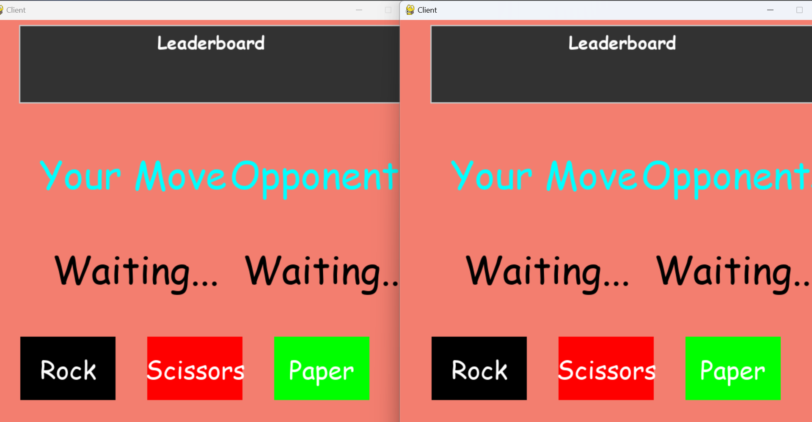
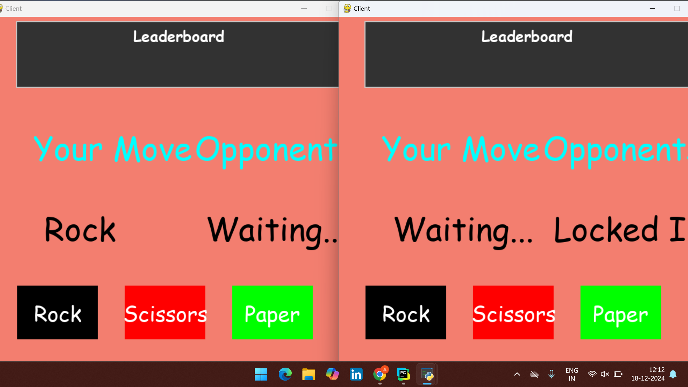
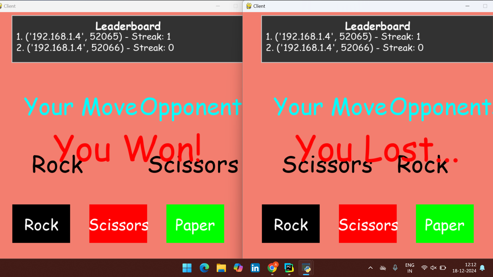

# MultiplayerGame
# Rock Paper Scissors Multiplayer Game

This is a multiplayer Rock-Paper-Scissors game implemented in Python using the `socket` module and `pygame` for the graphical interface. Players can connect to the server, play against each other, and see a leaderboard displaying the top three players based on their win streaks.

---

## Features

- **Multiplayer Gameplay**: Players can connect to a central server to play the classic game of Rock-Paper-Scissors against each other.
- **Leaderboard**: Displays the top three players with their names and win streaks.
- **User-friendly Interface**: Built with `pygame`, the interface is interactive and visually appealing.
- **Name Input**: Players can enter their name before starting the game.

---

## Technologies Used

- **Python**
  - `socket` for networking
  - `pickle` for data serialization
  - `pygame` for the graphical user interface

---

## How to Run the Project

### Prerequisites
- Python 3.x installed on your system
- `pygame` library installed (run `pip install pygame`)

### Setup
1. Clone the repository:
   ```bash
   git clone https://github.com/your_username/rock-paper-scissors-multiplayer.git
   cd rock-paper-scissors-multiplayer
   ```

2. Start the server:
   ```bash
   python server.py
   ```

3. Start the client:
   ```bash
   python client.py
   ```
   Repeat this step to connect multiple players.

---

## File Structure

```
rock-paper-scissors-multiplayer/
├── client.py      # Client-side code
├── server.py      # Server-side code
├── network.py     # Networking class for client-server communication
├── game.py        # Game logic and rules
├── README.md      # Project documentation
```

---

## Gameplay Instructions
1. Run `server.py` to start the server.
2. Run `client.py` for each player.
3. Enter your name in the input box on the menu screen.
4. Once connected, click on Rock, Paper, or Scissors to make your move.
5. The game displays the result and updates the leaderboard.

---

## Demonstration
### Menu Screen


### Gameplay Screen


### Leaderboard


---

## Leaderboard
- Tracks and displays the top three players based on their win streaks.
- Resets player streaks after a loss.

---

## Future Enhancements
- Add chat functionality between players.
- Implement a matchmaking system for larger groups.
- Add sound effects for moves and results.
- Make the leaderboard persistent across sessions.

---
